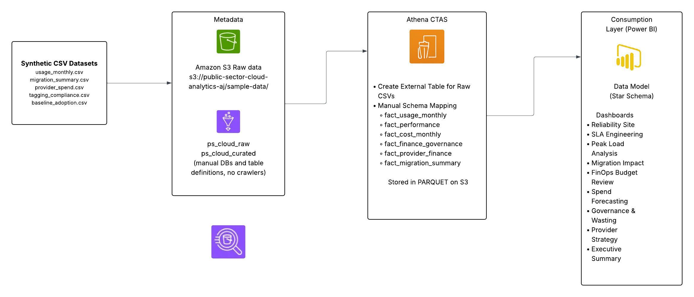
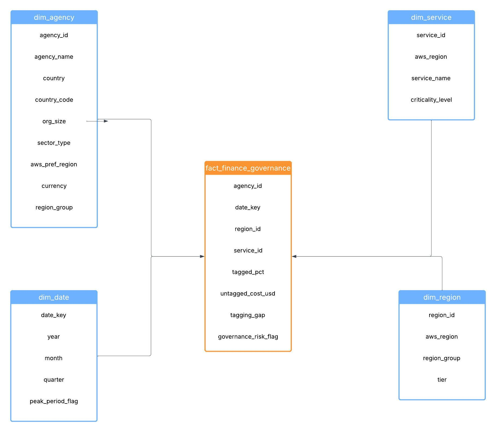
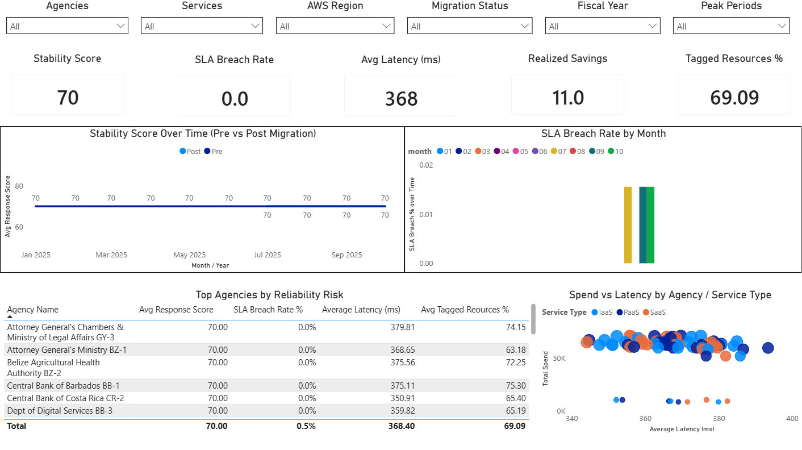
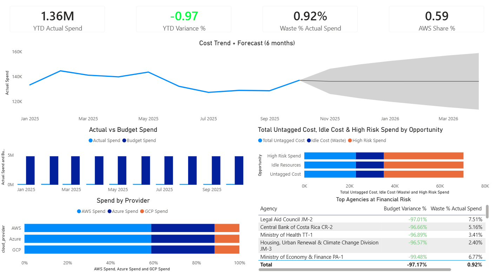

# Public-Sector Cloud BI Analytics

  

  <strong>Architecture Overview – AWS Lakehouse + Power BI</strong>

Showing a unified view of services after migration to the cloud

# 1. Project Title: Public Sector Cloud BI Analytics - Reliability, Performance & Cost Governance

# 2. Summary
    This Business Intelligence (BI) solution is designed to empower ministries and public-sector agencies by ensuring both the reliability and performance of their cloud services while simultaneously maintaining rigorous budget control and financial oversight. By integrating AWS-style analytics stack with FinOps cost data, the solution delivers actionable insights into service uptime, system performance, and operational expenditures. It enables agencies to monitor service reliability in real time, forecast future costs, and enforce governance practices to align with budget constraints. This dual-purpose approach supports both operational efficiency and financial accountability in the public sector's cloud environments.

    AWS Stack used:
    - S3 + Glue + Athena: Data Platform
    - Star-schema modeling: Analytics
    - Power BI dashboard: Storytelling
    - Two Business Narratives

# 3. Business Narratives
   a. Narrative 1 - Digital Service Reliability & Performance
                    As public sector agencies migrate to the cloud, maintaining digital service reliability and performance becomes critical. Often, cloud-based systems face challenges such as service disruptions or inconsistent performance. This BI solution addresses these issues by leveraging real-time telemetry data to monitor system uptime and performance, ensuring that any anomalies are quickly detected and resolved. By providing actionable insights, it helps agencies maintain the reliability needed for critical public services.
                    
                    - Key Questions from Leadership:
                        a. Are critical services reliable during peak periods e.g. tax times?
                        b. Did reliability improve post migration? 
                        c. Which services/MDAs generate the most SLA breaches, latency or errors?
                    
                    - Question answered:
                        a. Pre vs Post migration Latency, Error rate and SLA Breaches
                        b. Non-peak vs Peak performance
                        c. Service Risk ranking across agencies and regions
                        d. Relationship between utilisation, cost and reliability

   b. Narrative 2 - FinOps — Budget Governance, Forecasting & Cloud Cost Optimization
                    Cloud cost management is a significant challenge for public-sector agencies, with cost variability and waste often resulting from ineffective resource management and poor tagging practices. This BI solution integrates FinOps data to enable precise cost forecasting, enforce tagging governance, and identify inefficiencies. This approach helps agencies minimize waste, stay within budget, and ensure financial transparency while forecasting future expenses with greater accuracy.

                    - Areas MDAs have issues with post migration
                        a. Variable monthly spend away from accustomed fixed costs 
                        b. Unclear attribution of cost to agencies/services
                        c. Poor tagging governance (Untagged costs)
                        d. Difficult time identifying and forecasting spend to avoid waste (this is important as it greatly impacts budgets)
                    
                    - Areas this FinOps assists to answer
                        a. Budget assigned vs Actual Budget
                        b. Spending patterns and forecasts
                        c. Tagging compliance & untagged spend
                        d. Idle cost optimisation opportunities
                        e. Strategy for Multi-cloud providers

# 4. Architecture Overview
    This projct uses a hybrid Glue & Athena setup due to restictions encountered on the AWS account in use. This would therefore reflect a workaround in the event on constraints on an account.

## Architecture Diagram

  

    Logical Architecture:   
        Synthetic CSV:  S3 (raw & curated data lake)
                        AWS Glue: manual DB creation and table definitions
                        Amazon Athena: manual table creations:- Curated dimensions and fact tables created using CTAS
                        Power BI: engineering dashboards

# 5. Data Model / Star Schemas
## Star Schema

  

    All data used for this project has been synthetically generated to reflect that of what AWS public sector would use in their day to day while aligning to that of Caribbean Ministries, Division and Agencies (MDAs) and what they would look at with respect to migrating to the cloud.

    5.1 Data & Tables
        Raw Files (S3/sample-data/): agencies.csv – list of ministries / agencies (country, org size, preferred region)
                        baseline_adoption.csv – basic cloud maturity context
                        usage_monthly.csv – monthly usage & cost per agency/service/region
                        provider_spend.csv – annual spend by provider (AWS, Azure, GCP)
                        migration_summary.csv – pre/post migration cost & SLA info
                        tagging_compliance.csv – tagging % and untagged cost over time
        
        Curated Athena CTAS (S3/curated/)
        Dimensions: dim_agency – agency, country, sector type, org size, preferred AWS region
                    dim_date – month-level calendar with peak_period_flag
                    dim_service – service category (IaaS / PaaS / SaaS, criticality)
                    dim_region – AWS region + regional grouping
        
        Reliability Fact Tables: fact_usage_monthly – usage & cost per agency/service/month
                                 fact_performance – derived latency, error_rate_pct, SLA breach flags, response_time_score
                                 fact_migration_summary – pre/post migration cost, realised savings %, SLA change
        
        FinOps Fact Tables: fact_cost_monthly – cost, utilisation, workload units, cost_per_unit
                            fact_finance_governance – tagging %, untagged_cost_usd, governance_risk_flag
                            fact_provider_finance – provider-level spend & provider_share_pct
                            fact_forecast_input – monthly_cost time series per agency for forecasting
        
        Derived Views: v_cost_spikes – month-over-month spend growth & spike flags
                       v_cloud_waste – idle_cost based on utilisation < 20%

    Reliability Star Schema:

               dim_date
                  |
                  |
       dim_agency ---- dim_service ---- dim_region
                  \       |      /
                   \      |     /
                   fact_usage_monthly
                         |
                         |
               fact_performance
                         |
         fact_migration_summary ---- dim_cost_category
                         |
                 fact_tagging_compliance
                         |
                 fact_provider_spend

    Finance Star Schema:

                    dim_date
                        |
                        |
         dim_agency -- fact_cost_monthly -- dim_service
                        |
                 fact_tagging_compliance
                        |
                 fact_provider_spend
                        |
                 dim_cloud_provider

# 6. SQL Models
    RAW Layer
    This layer stores original, unaltered copies of the datasets simulated for this project in the S3 bucket that are queried in Athena but no transformations are applied to the originals. Due to IAM restrictions on the account, below is an example that shows the manual table creation for the raw data:
     --Provider spend table
        CREATE EXTERNAL TABLE IF NOT EXISTS ps_cloud_raw.ps_cloud_raw_provider_spend (
            agency_id int,
            country string,
            country_code string,
            year int,
            cloud_provider string,
            spend_usd double
        )
        ROW FORMAT SERDE 'org.apache.hadoop.hive.serde2.OpenCSVSerde'
        WITH SERDEPROPERTIES (
            'separatorChar' = ',',
            'quoteChar'     = '"',
            'escapeChar'    = '\\'
        )
        STORED AS TEXTFILE
        LOCATION 's3://public-sector-cloud-analytics-aj/sample-data/provider_spend/'
        TBLPROPERTIES (
            'skip.header.line.count' = '1',
            'use.null.for.invalid.data' = 'true');
    
     --sanity check
        SELECT * FROM ps_cloud_raw.ps_cloud_raw_provider_spend LIMIT 5;
    
    Curated Layer
    This layer turns raw datasets into analysis-ready tables. It involves normalization, filtering, deriving of metrics and identification of keys for joins. This layer was fully generated using Athena e.g.:
    --Dim agency
        CREATE TABLE ps_cloud_curated.dim_agency
        WITH (
            format = 'PARQUET',
            external_location = 's3://public-sector-cloud-analytics-aj/curated/dim_agency/'
        ) AS
        SELECT
            agency_id,
            agency_name,
            country,
            country_code,
            org_size,
            sector_type,
            aws_pref_region,
            currency,
            region_group
        FROM ps_cloud_raw.ps_cloud_raw_agencies;

    --sanity check
    SELECT * FROM ps_cloud_curated.dim_agency LIMIT 10;

    It also created the Dimensions: dim_date, dim_region, dim_services, dim_agency_clean.

    GOLD layers
    This layer contains business centered fact tables that support the BI story. All key metrics and flags are calcualted and ready for visualization e.g.:
     --Fact usage monthly
        CREATE TABLE ps_cloud_curated.fact_usage_monthly
        WITH (
                format = 'PARQUET',
                external_location = 's3://public-sector-cloud-analytics-aj/curated/fact_usage_monthly/'
            ) AS
            SELECT
                u.agency_id,
                d.date_key,
                s.service_id,
                r.region_id,
                u.service_type,
                u.compute_hours,
                u.storage_gb,
                u.data_egress_gb,
                u.utilisation_pct,
                u.cost_usd,
                u.resource_count,
                u.migration_status,
                u.aws_region
            FROM ps_cloud_raw.ps_cloud_raw_usage_monthly u
            LEFT JOIN ps_cloud_curated.dim_agency a
                ON u.agency_id = a.agency_id
            LEFT JOIN ps_cloud_curated.dim_service s
                ON u.service_type = s.service_type
            LEFT JOIN ps_cloud_curated.dim_region r
                ON u.aws_region = r.aws_region
            LEFT JOIN ps_cloud_curated.dim_date d
                ON date_parse(u.month || '-01', '%Y-%m-%d') = d.date_key;
  
     --sanity check
     SELECT * FROM ps_cloud_curated.fact_usage_monthly LIMIT 5;

     Here the Reliability and FinOps fact tables were created: fact_performance, fact_migration_summary, fact_cost_monthly, fact_finance_governance, fact_provider_finance, fact_forecast_input. Basic views were derived as well; v_cost_spikes, v_cloud_waste for optics in the event of leadership ask.

# 7. Dashboards
    Below are screenshots for each page of the PowerBI dashboard. 
    Power BI connected to Athena via Amazon Athena ODBC driver to load data from the S3 bucket.

    Reliability Dashboards
    - Reliability Overview: Stability Score (0-100), SLA Breach Rate %, Avrage Latency & Error Rat, Stability trend over time, Top Risk Services table

    - SLA Performance: Engineering KPIs (latency breaches, error breaches, utilisation score), SLA breach trends, Latency vs utilisation scatter (stress hotspots), Root-cause table for engineering teams

    - Peak vs Non-Peak: eak vs Non-Peak stability and latency, Peak-only SLA trends, Agencies/services that collapse under peak load

    - Migration Impact: Pre vs Post stability, latency, and SLA breaches, Migration summary by agency (cost_delta_usd, realised_savings_pct), Scatter of cost_delta vs stability_delta (cloud ROI vs reliability)

    FinOps Dashboards
    - Budget Oversight: YTD Actual vs Budget, YTD Variance % (Green/Yellow/Red), Budget vs Actual over time, Agency-level variance table

    - Cost Trends & Forecasting: Monthly spend trend + Power BI forecast, MoM Spend Growth %, Rolling 3-month spend, Service mix over time (IaaS / PaaS / SaaS), Top-growth agencies table

    - Governance & Waste: Tagged % and governance risk count, Untagged Cost and Waste % (idle cost), Agency-level governance heat table, Waste by service and agency

    - Provider Strategy: Spend by provider (AWS / Azure / GCP) over time, Provider share % per agency, Concentration risk view (e.g. AWS share by agency)

    - Executive Summary (One-page view for executives): YTD Spend, Variance, Waste %, AWS dependency, High-level trend with forecast, Budget vs Actual Budget mini-view, Optimisation opportunities (untagged + idle cost + high-risk spend), Top agencies at financial risk

# 8. Key Insights
##    Digital Services Reliability & Performance insights
        "Some agencies show better stability and lowr SLA breaches post migration"
        "A few agencies carry high engineering risks due to: under-utlized resources , low tagging compliance"
        "Opportunities exist for auto-scaling, caching, service refactoring"
    e.g. Migration improved stability by 28% across critical services."
        "Two agencies consumed 60% of the cloud budget due to storage-heavy workloads."
        "Forecast indicates a 12% budget overrun by Q4 without efficiency improvements."
        "Untagged cost accounted for 18% of spend, violating tagging policy guidelines."
        "Idle resources represent $180K/year in avoidable waste."
    
##    FinOps — Budget Governance, Forecasting & Cloud Cost Optimization insights
-       Budget Governance: several MDAs overspent on a YTD basis *input %*
                         : Forecast indicates possible budget issues in Q3 if no intervention is done
-       Waste & Optimization: Significant spend is linked to Idle resources 
                            : Untagged costs leads to reduced financial transparency and weakens chargeback (resources paid for by departments or agencies) / showback (IT/cloud cost presented to BUs) models
-       Provider Strategy: High concentration risk as some MDAs are rely heavily on AWS
                         : Some MDAs show multi-clod fragmentation which can lead to complex governance
    

# 9. Recommendations
    High-level governance and optimisation guidance:
    - Improve tagging policies
    - Implement quarterly forecasting cycles
    - Rightsize idle or under-utilised workloads
    - Introduce cost anomaly alerts
    - Expand PaaS usage to reduce IaaS-heavy costs

# 10. How to Run this Project
    - Prerequisites: AWS account with S3, Glue and Athena access, Power BI Desktop (free), Ahtena ODBC driver (to connect S3 to Power Bi)
        1. Clone Repo
        2. Create / Upload raw files into S3
        3. Create manual Databases in Glue and manually create 3 raw tables (for learning or can just create all in Athena)
        4. Create scripts for manual raw table creation & CTAS within Athena to build dimensions, facts and views 
        5. Use the Athena ODBC driver and configure DSN (install ODBC driver if needed). Open PowerBI, connect to Athena and import curated tables from ps_cloud_curated and Power Bi auto determines relationships (double check for accuracy). Build any DAX measures needed after loading.

# 11. Repository Structure
        
        - dashboards/         # Power BI files (reliability + FinOps)
        - data/               # Sample raw/curated data (if included)
        - diagrams/           # Architecture + star schema diagrams
        - docs/               # Detailed write-ups for each use case
        - screenshots/        # PNGs used in README / portfolio
        - sql/                # Athena CTAS + view definitions
        - README.md           # This file

# 12. Skills Demonstrated & Learned
    a. BI Engineering (Dimensions, fact tables, CTAS pipelines)
    b. Data Modeling (Star Schemas)
    c. AWS (S3, Glue, Athena)
    d. SQL (Modeling, aggregation, derived metrics, views, time-series prep)
    e. Power BI (Data modeling, DAX measures, executive & engineering dashboards)
    f. FinOps Governance (Budget vs Actual, cost forecasting, tagging governance, waste analysis)
    g. Public-Sector Analytics (A focus on MDAs, budgets and constraints, auditability and accountability)

# 13. About the Author
    Hi, I'm Alain Julien a public-sector business intelligence and systems analyst with hands-on experience supporting enterprise HR, cloud-migration, and data-modernization initiatives across government. My work involved BI, data modeling, business process optimization, stakeholder managment, system testing and understanding and identifying day-to-day operational analytics to help MDAs make faster, evidence-driven decisions. I am currently transitioning into business intelligence engineering, with the use of AI-assisted insights to build cloud-ready analytics solutions and end-to-end data pipelines. My goal is truly seeing the impact data can have on creating a digital government and improving how public institution services serve people, while identifying measurable transformations goals to help institutions reach this goal.

#   Dashboard Gallery

### Reliability – Executive Overview

  

### FinOps – Executive Summary

  

